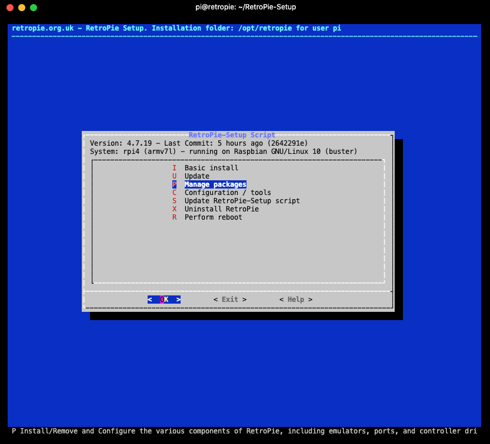
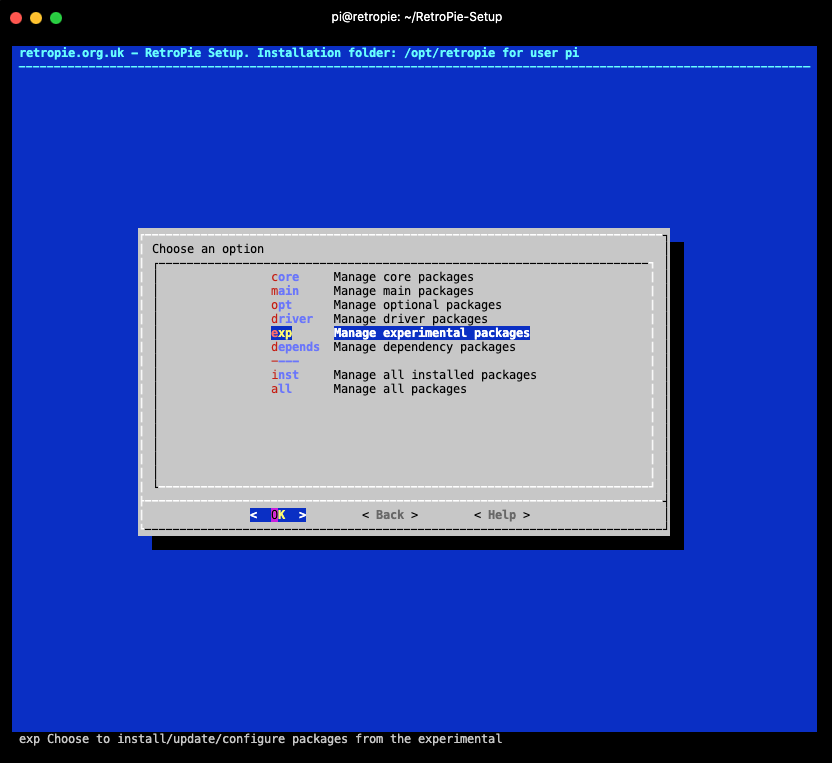
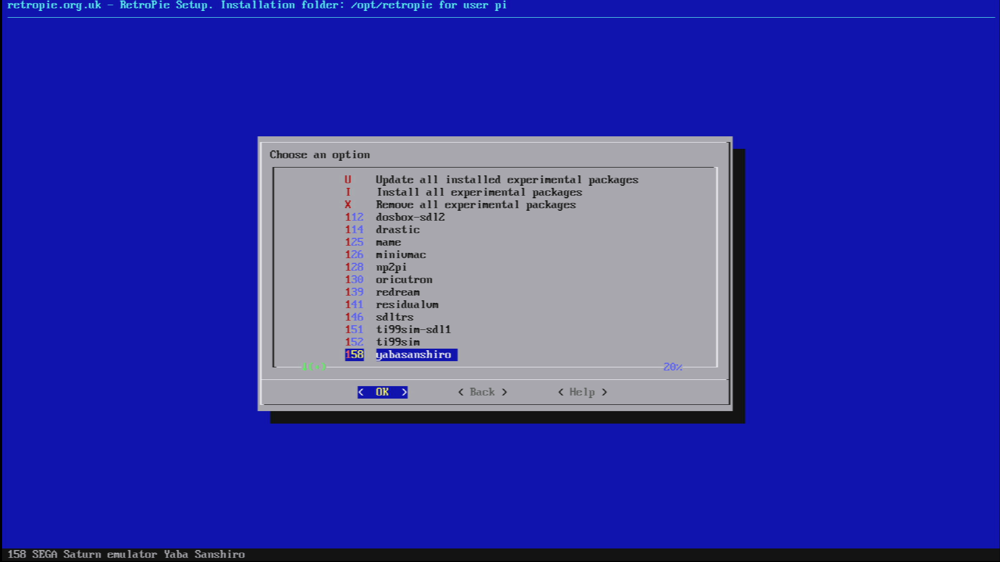
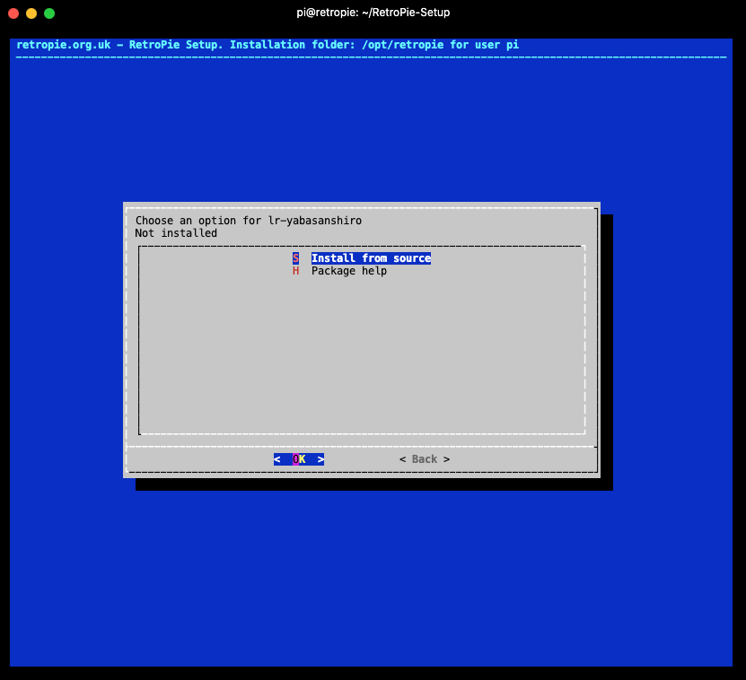
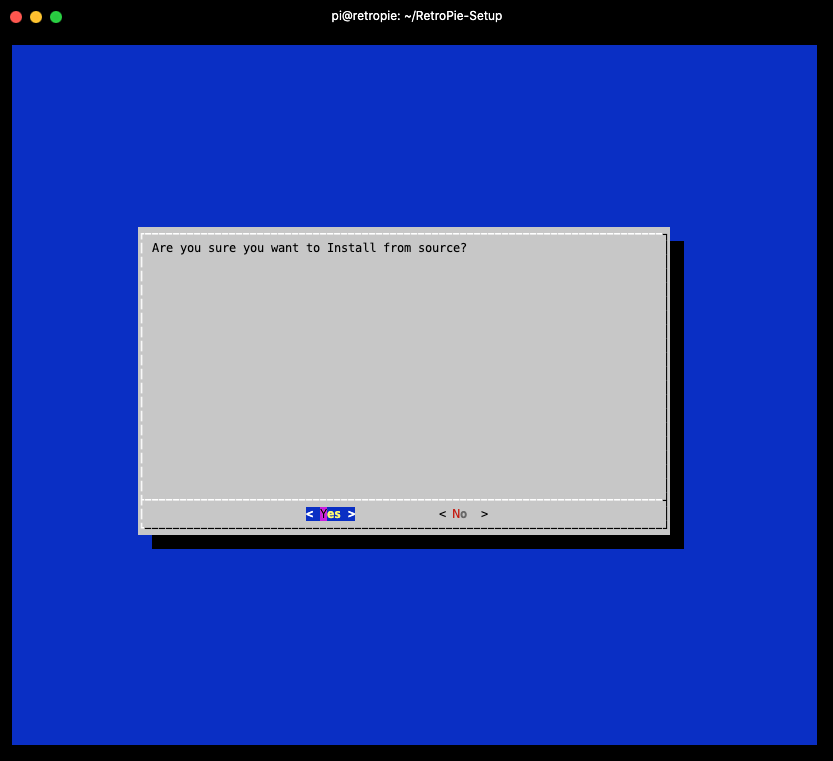

# MiniSSCM4
for the RGR CM4 carrier for SEGA Saturn Model made by BANDAI

**1**. 
add these at the very end of /boot/cmdline.txt (please make sure everything is in one single line)
```markdown
vt.global_cursor_default=0 logo.nologo loglevel=0 splash silent quiet
```
If you don't want any kernel message printed during booting, you can simply change below in **/boot/cmdline.txt**

> console=**tty1**

to 
>console=**tty3**


**2**. 
Copy files of overlays sub folder of this repo into the **overlays** sub-folder of boot partition of SD card.


**3**. 
Now, copy the right config.txt (don't forget the change the file name from this repo back to config.txt) and
Have fun!

#  
# To install RPi4/CM4 compatible yabasanshiro core
**1**.  
Upate your RetroSetup script to the latest version.  
```markdown
sudo ~/RetroPie-Setup/retropie_setup.sh
```

and then execute the `Update RetroPie-Setup script` feature.
  
  
  
  
**2**.

download necessary script for RetroPie-Setup
```markdown
cd ~/RetroPie-Setup/scriptmodules/emulators
wget https://raw.githubusercontent.com/devmiyax/yabause/b96dbd2393a3f9482d37344fd5d1c60fa68cac35/yabause/src/retro_arena/yabasanshiro.sh
chmod 755 yabasanshiro.sh
cd ~/RetroPie-Setup/
sudo ./retropie_setup.sh
```
And now the RetroPie-Setup would be executed again, now, we do as follow steps.  
--> `Manage packages`   

  
-> `Manage experimental packages`   

  
-> `yabasanshiro` 

  
-> `Install from source`  


  
-> `<Yes>`  



Once the code compiled as expected, then you would copy BIOS/ROM files and restart your EmulationStation.  
And Now it is about time to have fun! :)


## Instruction video.

[](https://youtu.be/tgiJdss_sgQ?t=0)


